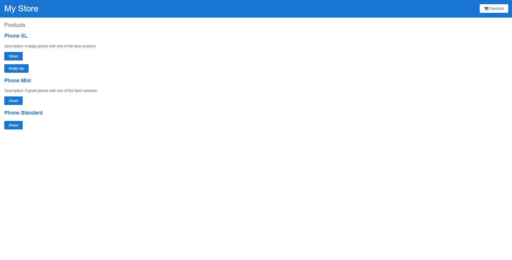

# CartShopping

Esse projeto foi gerado com o [Angular CLI](https://github.com/angular/angular-cli) version 13.2.3.

## Servidor no modo developer

Execute `ng serve` para um servidor dev. Acesse `http://localhost:4200/`. O aplicativo irá se atualizar automaticamente, sem que seja necessário fazer o reload no browser.

## Deploy Automático integrado ao Netlify 

A branch `main` está integrada continuamente através da plataforma Netlify 

Status: ,

A aplicação está hospedada neste [link](https://youthful-hypatia-124de5.netlify.app/).
